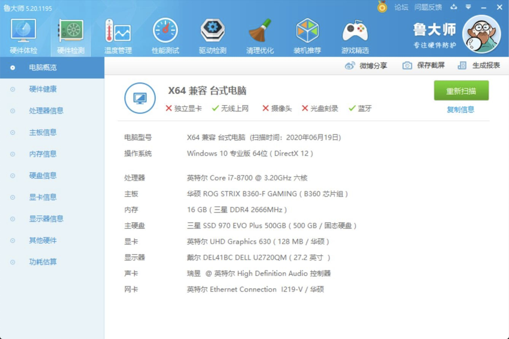
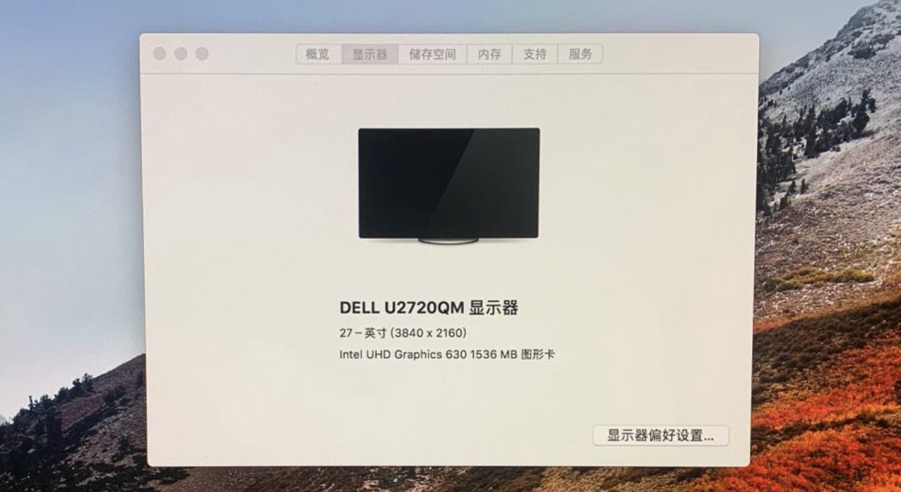
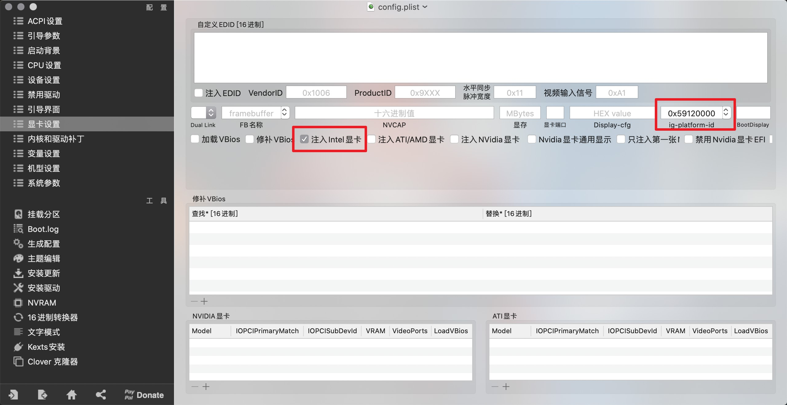
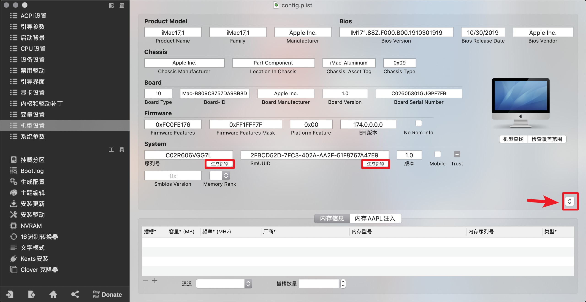

# 🚀 黑苹果 10.13.6 华硕B360F i7-8700 核显UHD630 跑4K

## 🌲 台式机配置

| 硬件   | 品牌型号                                          |
| ------ | ------------------------------------------------- |
| 处理器 | 英特尔 Core i7-8700 @ 3.20GHz 六核                |
| 主板   | 华硕 ROG STRIX B360-F GAMING ( B360 芯片组 )      |
| 内存   | 16 GB ( 三星 DDR4 2666MHz )                       |
| 主硬盘 | 三星 SSD 970 EVO Plus 500GB ( 500 GB / 固态硬盘 ) |
| 显卡   | 无                                                |
| 显示器 | 戴尔 DEL41BC DELL U2720QM ( 27 英寸  )            |

## 🍀 EFI

同级目录下`10.13.6-EFI(B360F-i7 8700 UHD630).zip`

## 🖥 吃上苹果的样子

## 🎢 安装过程

### 🎮 硬件相关问题

- `970 EVO Plus`固件版本需升级到 `2B2QEXM7`，否则无法安装系统

### 🎼 CLOVER 引导相关问题

| 卡点            | 着手方向                                                          |
| --------------- | ----------------------------------------------------------------- |
| UHD630 无法驱动 | 修改显卡设置，勾选`注入Intel显卡`，ig-platform-id选择`0x59120000` |

## 🚁 一图胜千言

**UHD630 无法驱动**

**机型设置为iMac17,1 不同机型可能导致USB不可用**

## 🌝 网卡蓝牙模块

推荐使用黑苹果免驱版

tip：如果有多余的无线路由器，可重置路由选择`桥接模式`使用LAN接口通网。
