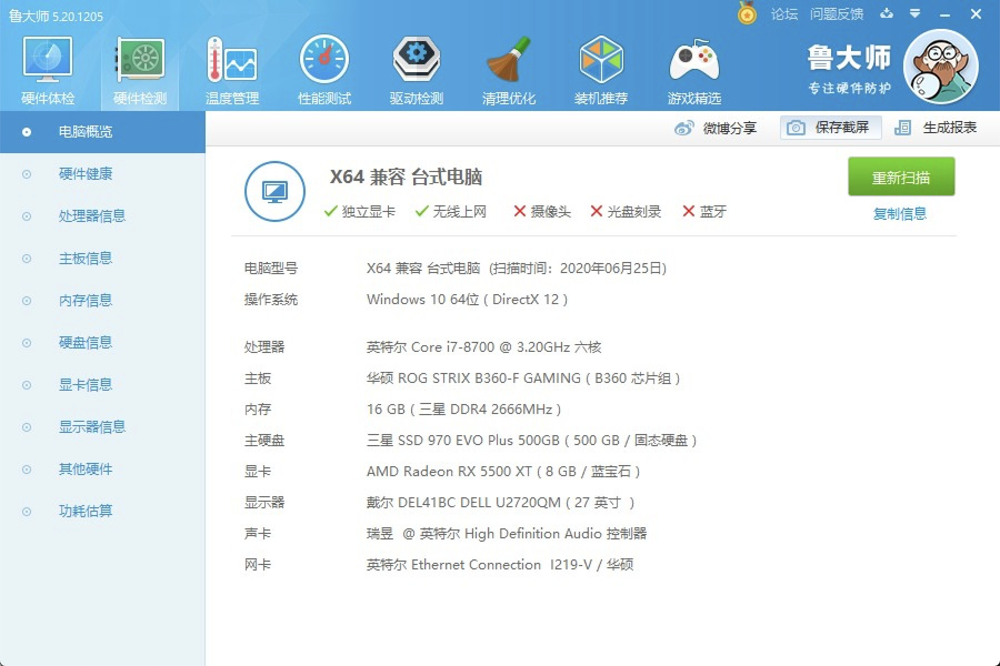
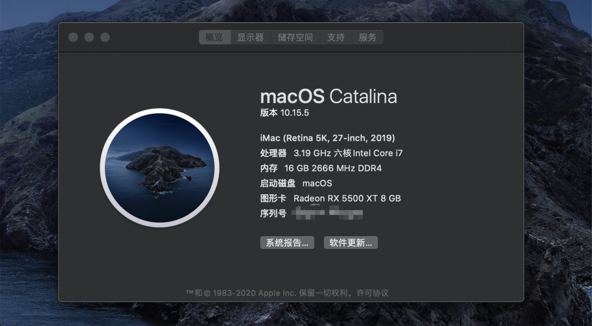
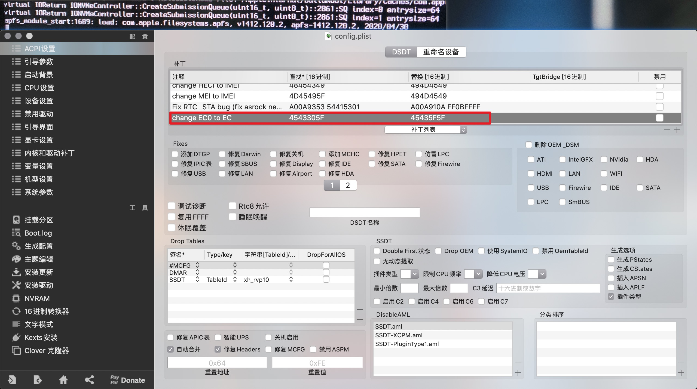
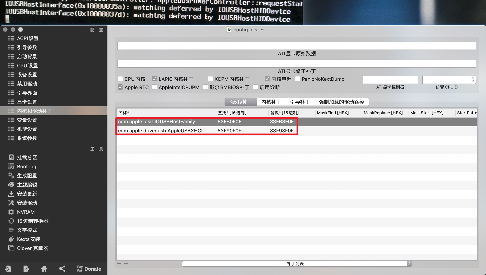
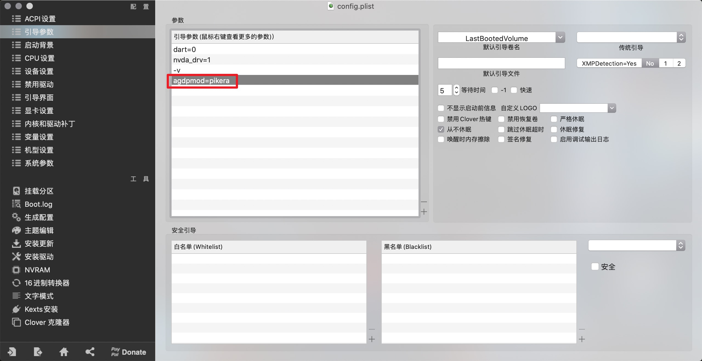
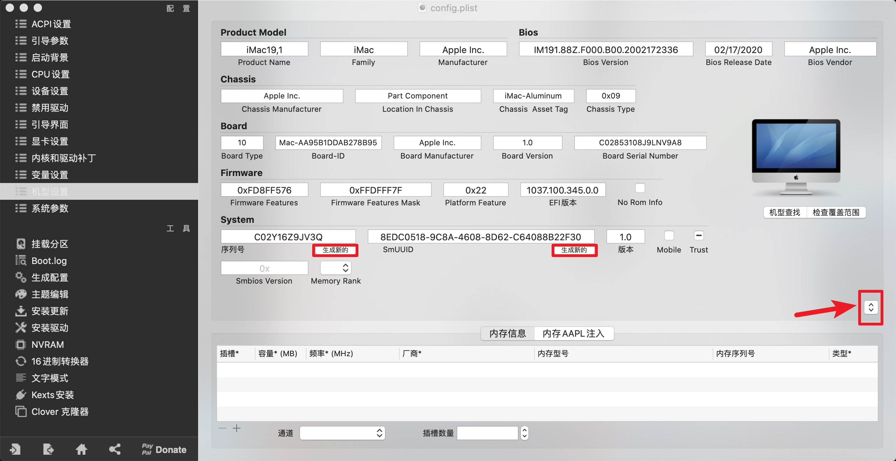
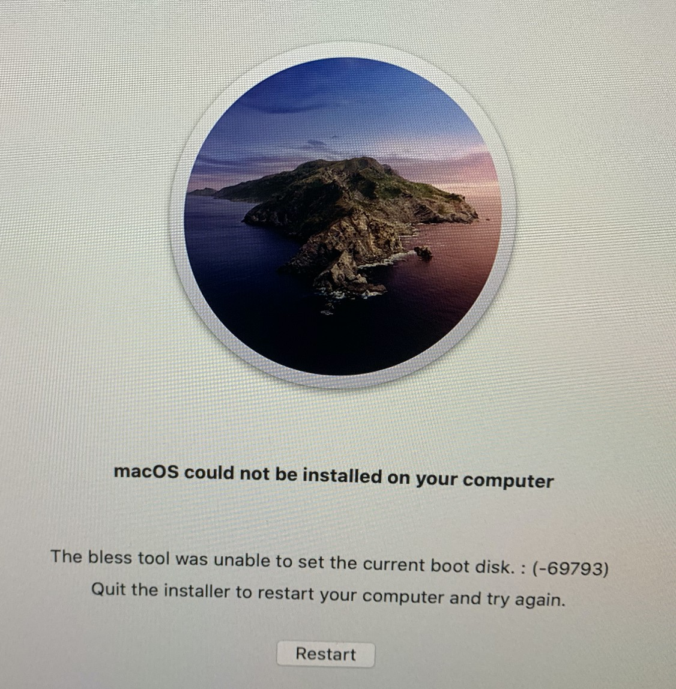
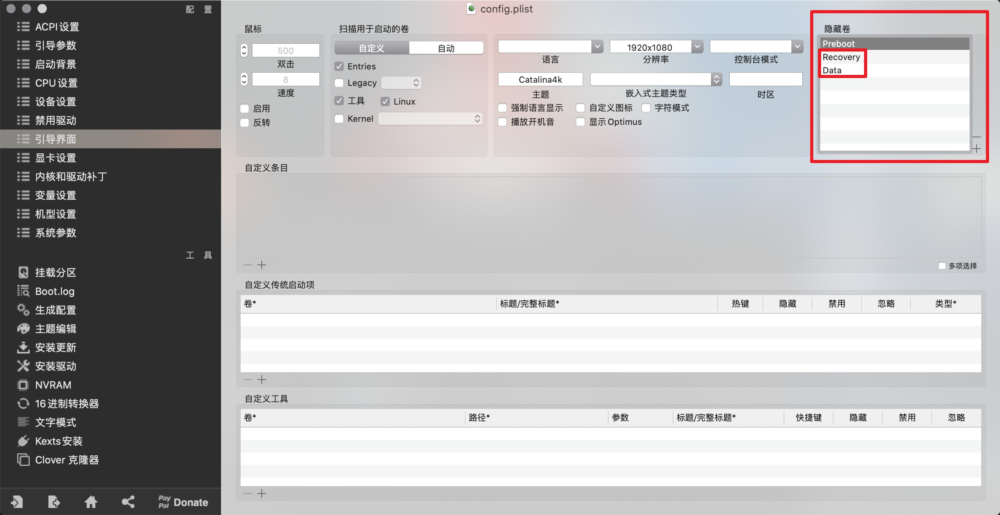

# 🚀 黑苹果 10.13.6 升级 10.15.5 华硕B360F i7-8700 蓝宝石RX5500XT 踩坑

## 🌲 台式机配置

| 硬件   | 品牌型号                                          |
| ------ | ------------------------------------------------- |
| 处理器 | 英特尔 Core i7-8700 @ 3.20GHz 六核                |
| 主板   | 华硕 ROG STRIX B360-F GAMING ( B360 芯片组 )      |
| 内存   | 16 GB ( 三星 DDR4 2666MHz )                       |
| 主硬盘 | 三星 SSD 970 EVO Plus 500GB ( 500 GB / 固态硬盘 ) |
| 显卡   | AMD Radeon RX 5500 XT ( 8 GB / 蓝宝石 )           |
| 显示器 | 戴尔 DEL41BC DELL U2720QM ( 27 英寸  )            |

## 🍀 EFI

同级目录下`10.15.5-EFI(B360F-i7 8700-RX5500XT).zip`

## 🖥 吃上苹果的样子

## 🎢 安装过程

### 🎮 硬件相关问题

- `970 EVO Plus`固件版本需升级到 `2B2QEXM7`，否则无法安装系统

### 🎼 CLOVER 引导相关问题

| 卡点                                      | 着手方向                                              |
| ----------------------------------------- | ----------------------------------------------------- |
| apfs_module_start:1689                    | DSDT打补丁【change EC0 to EC】                        |
| matching deferred by IOUSBHostHIDDevice   | 内核和驱动补丁>添加Kexts补丁(↓↓↓10.15.x Kexts补丁↓↓↓) |
| 结束啰嗦模式，进入安装系统时黑屏          | A卡需添加引导参数`agdpmod=pikera`                     |
| 进入安装系统选择语言时发现USB设备都不可用 | 机型设置为`iMac19,1`                                  |

### 🎃 10.15.x Kexts补丁

| 名称                              | 查找     | 替换     |
| --------------------------------- | -------- | -------- |
| com.apple.iokit.IOUSBHostFamily   | 83FB0F0F | 83FB3F0F |
| com.apple.driver.usb.AppleUSBXHCI | 83F90F0F | 83F93F0F |

### 🐛 系统安装相关问题

- 安装进度100%后出现`NAME could not be installed on your computer`提示重装，此时系统已经写入完成可正常使用，不清楚什么原因导致，暂且无视，直接重启电脑即可。刚才的问题会使引导界面入口选项会多出一个`Data`启动项，可通过修改配置文件将其隐藏。

## 🚁 一图胜千言

**卡点1-apfs_module_start:1689**

**卡点2-matching deferred by IOUSBHostHIDDevice**

**卡点3-结束啰嗦模式，进入安装系统时黑屏**

**卡点4-进入安装系统选择语言时发现USB设备都不可用**

**卡点5-安装进度100%后提示重装，可忽略，直接重启**

**隐藏启动项**

## 🌝 网卡蓝牙模块

推荐使用黑苹果免驱版

tip：如果有多余的无线路由器，可重置路由选择`桥接模式`使用LAN接口通网。
